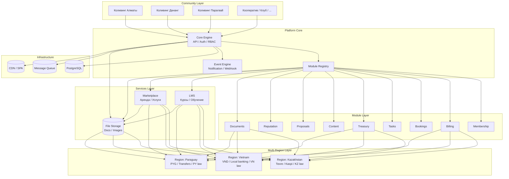

# Tribe — Vision Document

> **Продукты:** CoLive (коливинги) · CoWork (коворкинги) · CoOper (кооперативы) · …
> *Зонтичная структура опциональна — может быть пересмотрена.*

## Миссия

Платформа-конструктор для самоуправляемых сообществ. Люди не просто арендуют место — они становятся участниками сообщества с правами, обязанностями, репутацией и совместным принятием решений.

## Ключевые принципы

- **Модульность** — каждое сообщество собирает свой набор модулей как LEGO
- **Самоорганизация** — инструменты для горизонтального управления, но с гибкостью под любую модель (владелец → совет → полная демократия)
- **Региональная гибкость** — настраиваемая юридическая и финансовая логика под страну (Казахстан → Вьетнам → Парагвай)
- **Мультикейсовость** — старт с коливингов, затем кооперативы, клубы, ТСЖ и другие сообщества

## Дорожная карта регионов

1. **Казахстан** (старт: Алматы)
2. **Вьетнам** (Дананг)
3. **Парагвай**

## Первый кейс: Коливинг

### Пилотное сообщество

Сеть коливингов в Алматы: 3 дома (Gundi, StartUp House, Park), ~12 жильцов каждый (~36 человек). Проводятся мероприятия. Требуется инструмент для координации, платежей и самоорганизации.

### Ценностное предложение для коливинга

Что платформа даёт жильцам и владельцам:

| Что решаем | Как |
|---|---|
| Сбор взносов и сплит коммуналки | Автоматические подписки, прозрачные начисления |
| Бронирование комнат/мест | Календарь, онлайн-бронирование |
| Обязанности по дому | Дежурства, задачи, напоминания |
| Общий бюджет | Прозрачная казна: приход/расход, голосования по тратам |
| Мероприятия | Афиша, регистрация, напоминания |
| Репутация жильцов | Рейтинг, отзывы, доверие |
| Решения по дому | Голосования: закупки, правила, ремонт |
| Договоры и документы | Электронные договоры заезда, акты |

### Модули первого релиза (MVP)

| Модуль | Описание |
|---|---|
| Membership | Заявки, статусы участников, профили |
| Subscriptions / Billing | Платежи, подписки, сплит платежей |
| Bookings | Бронирование комнат и пространств |
| Tasks | Дежурства, уборка, обязанности |
| Treasury | Общий бюджет, прозрачность, лимиты |
| Content | Афиша, объявления, обсуждения |
| Proposals | Голосования по общим вопросам |
| Reputation | Рейтинг, уровни доверия |
| Documents | Договоры, акты, правила дома |

Вторая очередь: Gamification (уровни, достижения), Groups (комнаты/команды внутри дома), Federation (связка домов в сеть).

Третья очередь — платные сервисы: LMS (курсы), Marketplace (аренда, услуги), Revenue (распределение доходов).

### Модель управления

Гибкая: от "владелец управляет" до "полное самоуправление".
- Владелец настраивает роли и права
- По мере зрелости сообщества передаёт функции жильцам
- Голосования, делегирование, предложения — все инструменты на месте

## Платные сервисы (монетизация)

Платформа даёт сообществам не только инструменты управления, но и возможность зарабатывать.

### LMS — Курсы

Любое сообщество может создавать и продавать курсы:
- **«Как открыть свой коливинг»** — пошаговое руководство от владельцев действующих коливингов
- **Управление сообществом** — навыки фасилитации, решения конфликтов
- **Soft skills** — языковые курсы, йога, медитация (от резидентов)

### Marketplace — Аренда и услуги

- **Аренда комнат** — публикация свободных мест для внешних гостей (не участников сообщества)
- **Услуги резидентов** — клининг, трансфер, экскурсии, фотосъёмка
- **Пространства под мероприятия** — аренда лаунжа / коворкинга на час/день

### Модель дохода

Доход от сервисов распределяется по принципу «кто создаёт ценность — тому большая часть». Если актив общий (комната, пространство) — доход идёт в казну и резидентам. Если труд индивидуальный (курс, услуга) — большую часть получает автор.

| Сервис | Кому | Резидентам | В казну |
|---|---|---|---|
| Курс (LMS) | Автору — **75%** | **10%** | **15%** |
| Аренда комнаты (внешним) | — (актив дома) | **30%** | **70%** |
| Услуга резидента | Исполнителю — **80%** | **10%** | **10%** |
| Аренда пространства | — (актив дома) | **25%** | **75%** |

Проценты настраиваются для каждого типа сервиса и могут меняться голосованием сообщества.

Доля резидентов распределяется по **взвешенной доле участия**: стаж, дежурства, голосования, платежи, репутация. Каждый участник получает ровно столько, сколько вложил в жизнь дома.

## Архитектура платформы

