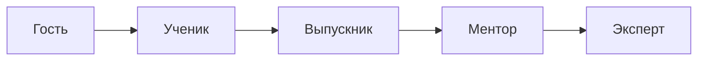

# CoGuild — Платформа для тематических сообществ

*Продукт экосистемы Tribe.*

---

## Концепция

CoGuild — это платформа для тематических образовательных сообществ. Эксперт (гильдия) приглашает учеников, создаёт курсы, запускает проекты. Ученики учатся, применяют знания на практике, а лучшие выпускники сами становятся менторами и ведут новые проекты. Всё внутри одного сообщества.

## Проблема

Онлайн-школы и курсы — это разовые продажи. После покупки курса ученик остаётся один: нет сообщества, нет проектной практики, нет пути от новичка до мастера.

Экспертам тоже сложно:
- Управление учениками вручную (Telegram, Excel, Notion)
- Нет инструментов для проектной работы
- Нет механик удержания: ученик купил курс и исчез
- Нет репутации и отзывов

## Пример: Школа программирования

- **Основатель** — опытный разработчик
- **Приглашает учеников** — заявки, отбор, оплата курса
- **Курсы** — уроки, домашки, вебинары
- **Проекты** — хакатоны, open source, стартапы внутри сообщества
- **Выпускники** — становятся менторами для новичков, растут в рейтинге
- **Гильдия** — сообщество практикующих разработчиков, где каждый учит и учится

То же применимо к: дизайн-студиям, языковым клубам, музыкальным школам, digital-агентствам, школы йоги.

## Модули

### Базовые

| Модуль | Назначение |
|---|---|
| **Membership** | Ученики, менторы, эксперты, статусы, заявки |
| **LMS** | Создание курсов, уроки, домашки, вебинары, сертификаты |
| **Tasks** | Проекты, хакатоны, командные задания, трекинг прогресса |
| **Billing** | Оплата курсов, подписки, донаты, гранты на проекты |
| **Treasury** | Общий бюджет, гранты ученикам, фонд сообщества |
| **Content** | Афиша, обсуждения, успешные кейсы, портфолио |
| **Proposals** | Голосования: какие курсы запускать, распределение бюджета |
| **Reputation** | Рейтинг учеников и менторов, нашивки, уровни |
| **Documents** | Договоры обучения, соглашения, сертификаты |

### Сервисы (монетизация)

| Модуль | Назначение |
|---|---|
| **Marketplace** | Фриланс-проекты внутри сообщества, заказы от внешних |
| **Revenue** | Распределение дохода (эксперт / менторы / казна) |

## Модель участников

| Тип | Описание | Голос |
|---|---|---|
| **Эксперт (Мастер)** | Создаёт курсы, ведёт проекты | Да (больший вес) |
| **Ментор** | Выпускник, помогает новичкам | Да |
| **Ученик** | Проходит обучение, участвует в проектах | По темам |
| **Гость** | Смотрит контент без покупки курса | Нет |
| **Админ** | Управляет сообществом | Вето |

## Жизненный цикл участника



Каждый этап — не просто статус, а набор прав, доступа и доли в доходах сообщества.

## Экономика

### Доходы

| Сервис | Суть |
|---|---|
| **Платные курсы** | Разовая оплата или подписка на доступ |
| **Подписка на сообщество** | Ежемесячный доступ к проектам, менторству, ивентам |
| **Гранты на проекты** | Сбор средств учениками на свои проекты |
| **Фриланс-заказы** | Marketplace с заказами внутри и снаружи |

### Распределение доходов

| Сервис | Кому | В казну сообщества |
|---|---|---|
| Курс | Эксперту — **75%** | **25%** |
| Подписка ученика | Менторам (по часам) — **60%** | **40%** |
| Грант на проект | Команде проекта — **90%** | **10%** |
| Фриланс-заказ | Исполнителю — **85%** | **15%** |

## Архитектура

```
Tribe
  ├── CoLive (коливинги)
  ├── CoSpace (пространства)
  ├── CoSettle (поселения)
  ├── CoGuild (гильдии / тематические сообщества)
  └── CoOper (кооперативы)
```

---

*Названия продуктов и зонтичная структура — предварительные, могут быть пересмотрены.*
