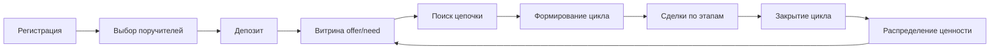

# Synergy — Платформа для синергетических циклов

*Продукт экосистемы Tribe.*

---

## Концепция

Synergy — это платформа, которая позволяет людям обмениваться товарами и услугами напрямую, через замкнутые цепочки участников, без посредников и денег как единственного средства расчёта. Каждый участник защищён страховым депозитом, двумя поручителями и механизмом рекламации — это «иммунная система» кооперации, которая быстро выявляет и устраняет недобросовестность.

В синергетическом цикле совокупные возможности участников превышают простую сумму их индивидуальных вкладов — возникает новое качество (эмерджентность).

## Проблема

- Посредники, банки, маркетплейсы и государства забирают 10–90% ценности каждой сделки
- Иерархические структуры неэффективны: коррупция, раздутый аппарат, медленные решения
- Споры решаются годами через суды, затраты несопоставимы с результатом
- Нет инструментов для прямого многостороннего обмена (цепочки «спрос → предложение»)
- Деньги как единственный эквивалент обмена ограничивают возможность сделок там, где денег нет

## Примеры

### Фриланс-цикл (на основе эксперимента в Алма-Ате, 1998)

Няне нужна стрижка, но денег нет. Парикмахеру нужна обувь. Сапожнику нужно лечить зубы жене. Стоматологу нужна няня для ребёнка.

```
Няня → (стрижка) → Парикмахер → (обувь) → Сапожник → (лечение) → Стоматолог → (присмотр) → Няня
```

Цикл замкнут: каждый получает нужную услугу, платя своей. **Экономия 40–60%** против рыночных цен за счёт исключения посредников на каждом этапе.

### Инструментальная библиотека

Соседи складываются на дорогой инструмент (газонокосилка, дрель, 3D-принтер) — каждый вносит долю в фонд. Депозит покрывает риск поломки. Учёт использования — через Tasks. Кто больше пользуется — больше платит в фонд.

### Локальное производство

Фермер → переработчик → пекарня → потребители. Замкнутый цикл внутри района. Каждый этап даёт скидку 20% за счёт отсутствия логистики, упаковки, маркетинга, наценок сетей.

## Модули

### Базовые

| Модуль | Назначение |
|---|---|
| **Membership** | Участники, поручители, подопечные, статусы, EDS, профили |
| **Treasury** | Страховые депозиты, фонды циклов, учёт обязательств |
| **Billing** | Движение депозитов, расчёты в учётных единицах, квитанции |
| **Marketplace** | Витрины (offer/need), поиск цепочек, сделки, этапы цикла |
| **Documents** | Договоры поручительства, акты сделок, правила сети |
| **Proposals** | Голосования по спорным ситуациям, коллегиум поручителей |
| **Tasks** | Этапы синергетического цикла, назначение, трекинг |
| **Reputation** | Рейтинг участников, история рекламаций, рейтинг поручителей |
| **Revenue** | Распределение ценности по вкладу участников |

### Сервисы (монетизация)

| Модуль | Назначение |
|---|---|
| **Marketplace** (premium) | Продвинутый поиск цепочек, кросс-кластерный обмен |
| **Revenue** | Автоматический сплит экономии цикла |
| **LMS** | Обучение: как организовать цикл, как стать поручителем |

## Модель участников

| Тип | Описание | Голос |
|---|---|---|
| **Участник** | Физлицо или бизнес в сети, имеет депозит и поручителей | Да |
| **Поручитель** | Держит депозит подопечного, участвует в коллегиуме (макс 12 подопечных) | Да (вес выше) |
| **Подопечный** | Имеет двух поручителей, защищён депозитом | Да |
| **Организатор цикла** | Находит цепочку, собирает участников, координирует | Да |
| **Коллективный участник** | Группа (кооператив, виртуальная корпорация) как один узел | По доле |
| **Кандидат** | Подал заявку, ищет поручителей | Нет |

### Поручительство

Новый участник не может совершать сделки, пока не найдёт двух поручителей. Поручитель проверяет участника, держит его депозит и отвечает за него в спорах. Поручитель может брать комиссию за услугу. Если поручитель теряет контакт с подопечным — обязан снять поручительство.

## Жизненный цикл



## Экономика

### Принципы

- **Депозит — не трата, а страховка.** Средства остаются собственностью участника, используются только при спорных ситуациях
- **Учётные единицы вместо денег.** Внутри цикла расчёты ведутся в условных единицах (часы работы, объём услуг). Конвертация по соглашению сторон
- **Скидка 20% на этап.** Каждый этап цикла дешевле рыночного аналога за счёт исключения посредника. На 4 этапах — ~60% общей экономии
- **Распределение экономии** — пропорционально вкладу участника: объём услуг, поручительская нагрузка, организаторская роль

### Распределение ценности

| Роль | Доля экономии |
|---|---|
| Участник (исполнитель этапа) | **60%** (пропорционально объёму) |
| Организатор цикла | **10%** |
| Поручители (оба) | **10%** (по 5%) |
| В фонд сети | **20%** |

### Комиссия поручителя

Поручитель может установить свою комиссию за сопровождение депозита (0–5% от суммы сделок подопечного). Это мотивирует быть поручителем и отвечать за качество подопечных.

## Связь с другими продуктами

Synergy может работать как самостоятельный продукт или как кооперационный слой для других продуктов Tribe:

- **CoLive + Synergy** — жильцы коливинга организуют замкнутые циклы услуг (уборка, ремонт, транспорт)
- **CoSpace + Synergy** — инструкторы пространства обмениваются услугами и клиентами
- **CoOper + Synergy** — пайщики кооператива формируют циклы взаимных поставок
- **CoGuild + Synergy** — участники гильдии обмениваются проектными работами без денег
- **CoSettle + Synergy** — поселение формирует внутреннюю экономику (строительство, продукты, услуги)

## Открытые вопросы

### Глобальные поручители или только внутри сообщества?

Поручитель несёт ответственность за сделки подопечного. Если поручитель и подопечный в одном сообществе — связь очевидна. Но участник может быть в нескольких сообществах Tribe (CoLive + Synergy + CoGuild).

**Варианты:**

| Вариант | Суть |
|---|---|
| **Внутри сообщества** (текущий) | Поручитель действует только в рамках одного пресета. Участник выбирает поручителей отдельно для Synergy, отдельно для CoLive |
| **Глобальные** | Поручитель действует во всех сообществах участника на платформе. Один реестр поручителей |
| **Гибрид** | Глобальная пара поручителей при регистрации, но сообщество может вето или добавить локальные правила |

На старте Synergy поручительство работает **внутри сообщества**. Вопрос глобального реестра поручителей отложен до появления кросс-пресетных сценариев.

### Первые поручители (bootstrap)

Проблема: новый участник обязан иметь двух поручителей, но когда сеть пуста — поручителей нет.

**Варианты:**

| Вариант | Суть |
|---|---|
| **Групповой старт** | 3–7 человек регистрируются одновременно, выбирают поручителей друг из друга, вносят депозиты — круг замкнут. «60-минутный запуск» (проверено в Алма-Ате, 1998) |
| **Seed-поручитель от платформы** | Первые 20 участников получают платформу как временного поручителя с лимитом сделок. По мере роста сети поручительство передаётся реальным участникам |
| **Админ как корневой поручитель** | Основатель сообщества — первый поручитель для всех. Когда появляются другие поручители — передаёт подопечных |
| **Лимит без поручителя** | Новый участник без поручителей может совершить 1–2 сделки малого объёма (до N единиц), после чего обязан найти поручителей для продолжения |

На старте Synergy используется **групповой старт** (сценарий онбординга для 5–7 человек).

## Архитектура

```
Tribe
  ├── CoLive (коливинги)
  ├── CoSpace (пространства)
  ├── CoSettle (поселения)
  ├── CoGuild (гильдии)
  ├── CoOper (кооперативы)
  └── Synergy (синергетические циклы)
```

---

*Названия продуктов и зонтичная структура — предварительные, могут быть пересмотрены.*
