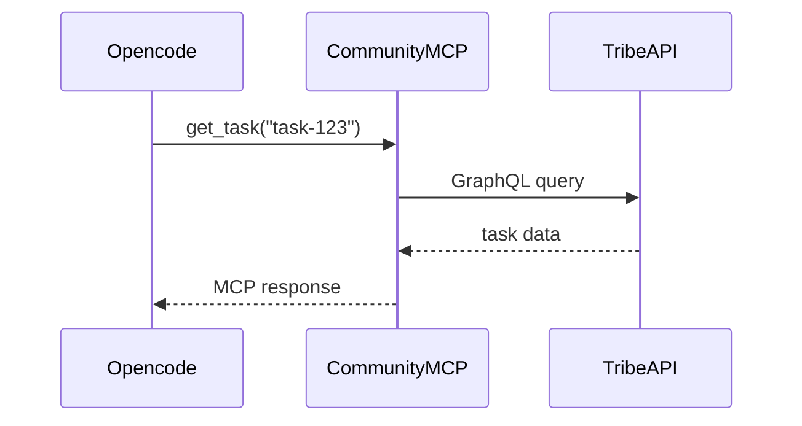

# Community MCP Server

MCP-сервер — прослойка между Agent'ом (opencode) и сообществом. Позволяет Agent'у читать данные сообщества и совершать действия через MCP-инструменты.

## Протокол

Стандартный [MCP](https://modelcontextprotocol.io) (JSON-RPC 2.0).

- **Transport:** stdio (при запуске opencode с `--mcp`) или HTTP (для внешних вызовов)
- **Resources:** данные (только чтение)
- **Tools:** действия (запись)

## Авторизация

Community MCP Server авторизуется как **bot-участник** сообщества через API-токен. Токен выдаётся при подключении Agent'а к сообществу (способ настройки — TBD, см. [platform-ecosystem.md](../architecture/platform-ecosystem.md#Настройка-Agent-в-сообществе-TBD)).

```
// Пример авторизации
Authorization: Bearer <bot-token>
```

Токен определяет:
- Какое сообщество
- Какие права у Agent'а (роль — TBD)
- Доступ к каким модулям разрешён

## Resources (данные)

| Resource | Описание |
|---|---|
| `community://info` | Информация о сообществе (название, пресет, участники) |
| `community://tasks/{id}` | Детали задачи (описание, статус, assignee, комментарии) |
| `community://tasks?status=open&assignee=@agent` | Поиск задач по фильтру |
| `community://projects/{id}` | Детали проекта и milestones |
| `community://proposals/{id}` | Голосование, статус, результаты |
| `community://metrics` | Бизнес-метрики сообщества |
| `community://member/{id}/reputation` | Репутация участника |

## Tools (действия)

| Tool | Параметры | Описание |
|---|---|---|
| `create_task` | `title`, `description`, `assignee?`, `priority?`, `tags?` | Создать задачу |
| `update_task` | `task_id`, `status`, `comment?` | Обновить статус задачи, добавить комментарий |
| `search_tasks` | `query`, `status?`, `assignee?`, `limit?` | Полнотекстовый поиск задач |
| `get_task` | `task_id` | Получить детали задачи |
| `link_task_to_project` | `task_id`, `project_id` | Привязать задачу к проекту |
| `get_project` | `project_id` | Получить проект с milestones |
| `get_member_reputation` | `member_id` | Репутация участника |
| `notify` | `channel`, `message` | Отправить уведомление (Telegram, чат сообщества) |

## Использование с opencode

Opencode поддерживает MCP через флаг `--mcp`. Community MCP Server запускается как подпроцесс.

```bash
opencode \
  --task "Исправить ошибку в модуле billing" \
  --mcp community-mcp-server \
  --mcp filesystem
```

Внутри opencode Agent может:

1. Через `community://tasks/{id}` — прочитать описание задачи и browser_context
2. Через `community://metrics` — проверить метрики до/после
3. Через `search_tasks` — найти похожие задачи (дедупликация)
4. Через `create_task` — создать подзадачу или связанную задачу
5. Через `update_task` — изменить статус на `review` после создания PR

### Пример вызова из координатора

```python
# Agent Coordinator: обработка события TaskAssigned
task = get_task_details(event.task_id)
context = read_mcp_resource(f"community://tasks/{event.task_id}")

subprocess.run([
    "opencode",
    "--task", task.description,
    "--mcp", "community-mcp-server",
    "--mcp", "filesystem",
    "--yes"
])

# После выполнения — обновить статус
call_mcp_tool("update_task", {
    "task_id": event.task_id,
    "status": "review",
    "comment": "PR created: https://github.com/.../pull/42"
})
```

## Реализация

Community MCP Server — тонкий слой (~200-300 строк), который:

1. Принимает MCP-запросы (JSON-RPC)
2. Транслирует их в GraphQL-запросы к API сообщества
3. Возвращает результат



**Язык:** любой, который умеет HTTP + JSON (Python, Go, TypeScript). На старте — **Python** (быстро прототипировать) или **Go** (легче деплоить).
