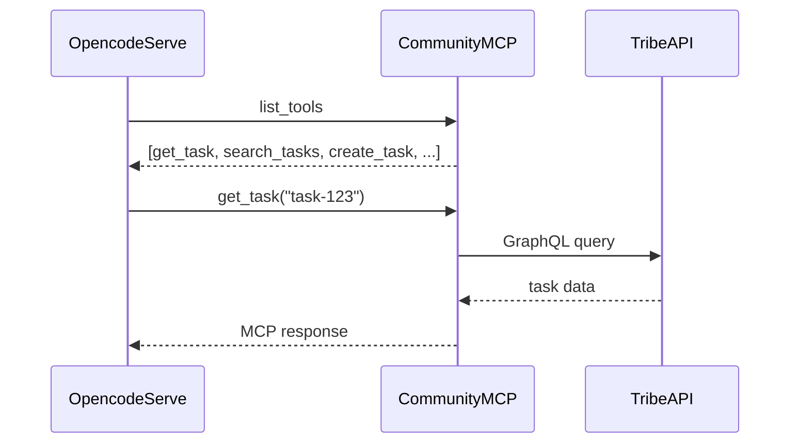

# Community MCP Server

MCP-сервер — прослойка между opencode serve и сообществом Tribe. Позволяет Agent'у читать данные сообщества и совершать действия через MCP-инструменты.

## Протокол

Стандартный [MCP](https://modelcontextprotocol.io) (JSON-RPC 2.0).

- **Transport:** HTTP (remote MCP)
- **Transport (альтернатива):** stdio (локальный запуск)
- **Resources:** данные (только чтение)
- **Tools:** действия (запись)

## Подключение к opencode serve

Community MCP Server подключается как **remote MCP** в `opencode.jsonc`:

```jsonc
{
  "mcp": {
    "community": {
      "type": "remote",
      "url": "http://localhost:3001/mcp",
      "headers": {
        "Authorization": "Bearer {env:COMMUNITY_BOT_TOKEN}"
      },
      "enabled": true
    }
  }
}
```

Opencode serve сам управляет подключением: загружает инструменты, вызывает их по необходимости, обрабатывает авторизацию. Никакой ручной интеграции не требуется.

## Авторизация

Community MCP Server авторизуется как **bot-участник** сообщества через API-токен. Токен передаётся в заголовке `Authorization` (см. конфиг выше).

Токен определяет:
- Какое сообщество
- Какие права у Agent'а (роль — TBD)
- Доступ к каким модулям разрешён

## Resources (данные)

| Resource | Описание |
|---|---|
| `community://info` | Информация о сообществе (название, пресет, участники) |
| `community://tasks/{id}` | Детали задачи (описание, статус, assignee, комментарии) |
| `community://tasks?status=open&assignee=@agent` | Поиск задач по фильтру |
| `community://projects/{id}` | Детали проекта и milestones |
| `community://proposals/{id}` | Голосование, статус, результаты |
| `community://metrics` | Бизнес-метрики сообщества |
| `community://member/{id}/reputation` | Репутация участника |

## Tools (действия)

| Tool | Параметры | Описание |
|---|---|---|
| `create_task` | `title`, `description`, `assignee?`, `priority?`, `tags?` | Создать задачу |
| `update_task` | `task_id`, `status`, `comment?` | Обновить статус задачи, добавить комментарий |
| `search_tasks` | `query`, `status?`, `assignee?`, `limit?` | Полнотекстовый поиск задач |
| `get_task` | `task_id` | Получить детали задачи |
| `link_task_to_project` | `task_id`, `project_id` | Привязать задачу к проекту |
| `get_project` | `project_id` | Получить проект с milestones |
| `get_member_reputation` | `member_id` | Репутация участника |
| `notify` | `channel`, `message` | Отправить уведомление (Telegram, чат сообщества) |

## Использование в Agent'ах

Когда opencode загружает Community MCP, его инструменты и ресурсы автоматически доступны Agent'ам. В промпте agent'а достаточно указать:

```
Используй инструменты community MCP:
- search_tasks — найти похожие задачи
- get_task — прочитать детали задачи
- create_task — создать новую задачу
- update_task — обновить статус
```

Opencode сам решает, когда вызывать MCP-инструменты. Никакой дополнительной обвязки не нужно.

## Примеры вызовов из Thin Coordinator

### Pipeline 1: Request → Task

```python
requests.post(f"{OPENCODE_URL}/session/{session_id}/message", json={
    "parts": [{"type": "text", "text": request.text}],
    "agent": "classifier",
    "noReply": True
})
```

Agent `@classifier` через community MCP:
1. `search_tasks` — ищет дубликаты
2. `create_task` — создаёт Task, если дубликатов нет

### Pipeline 2: Task Executor

```python
requests.post(f"{OPENCODE_URL}/session/{session_id}/message", json={
    "parts": [{"type": "text", "text": f"Выполни задачу {task_id}"}],
    "agent": "task-executor",
})
```

Agent `@task-executor`:
1. `get_task` — читает описание и контекст
2. Анализирует codebase
3. Создаёт PR
4. `update_task(status=review)` — обновляет статус

## Реализация

Community MCP Server — тонкий слой (~200-300 строк), который:

1. Принимает MCP-запросы (JSON-RPC over HTTP)
2. Транслирует их в GraphQL-запросы к API сообщества
3. Возвращает результат



**Язык:** Python, Go или TypeScript — любой с HTTP + JSON.
