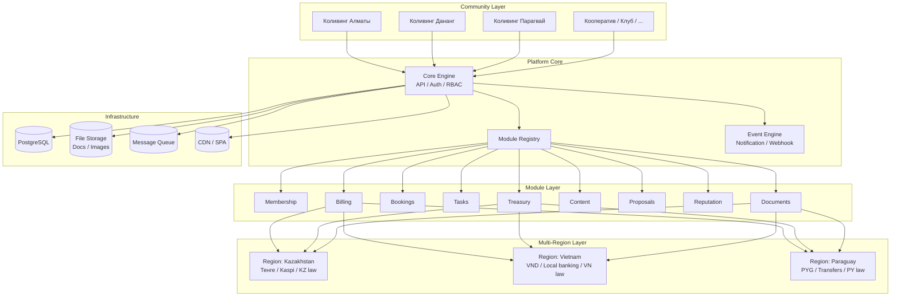

# Архитектура платформы

## Уровни

### 1. Community Layer

Сообщества подключаются к платформе. Каждое сообщество выбирает:
- регион (юрисдикцию)
- набор модулей
- модель управления

### 2. Platform Core

- Core Engine — API, авторизация (JWT), роли и права (RBAC)
- Module Registry — реестр активных модулей, их настройки и версии
- Event Engine — уведомления, вебхуки, внутренние события

### 3. Module Layer

Каждый модуль — независимый блок с API, хранилищем и настройками. Модули не зависят друг от друга, но могут обмениваться событиями.

### 4. Multi-Region Layer

Абстракция над региональными особенностями:
- **KZ**: тенге, Kaspi Pay, юридические шаблоны по КЗ РБ
- **VN**: VND, местные платёжные системы, право Вьетнама
- **PY**: парагвайский гуарани, банковские переводы, право Парагвая

Каждый модуль, которому нужна региональная логика (Billing, Treasury, Documents), обращается к этому слою.

### 5. Infrastructure

PostgreSQL, S3-совместимое хранилище, очередь сообщений, CDN для фронтенда.
