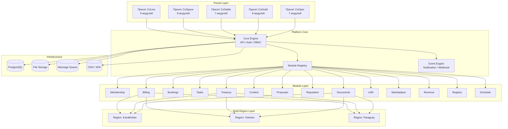

# Архитектура платформы



## Уровни

### 0. Preset Layer (пресеты)

Пресет — это конфигурация по умолчанию: набор модулей, настройки и модель управления под конкретный кейс. При создании сообщества пользователь выбирает пресет, а затем может донастроить модули.

| Пресет | Модули |
|---|---|
| **CoLive** | Membership, Billing, Bookings, Tasks, Treasury, Content, Proposals, Reputation, Documents |
| **CoSpace** | Membership, Schedule, Bookings, Billing, Content, Proposals, Reputation, Documents |
| **CoSettle** | Membership, Registry, Treasury, Proposals, Tasks, Content, Documents |
| **CoGuild** | Membership, LMS, Tasks, Billing, Content, Proposals, Reputation, Documents |
| **CoOper** | Membership, Registry, Billing, Treasury, Proposals, Content, Marketplace |

### 1. Platform Core

- **Core Engine** — API, авторизация (JWT), роли и права (RBAC)
- **Module Registry** — реестр всех модулей, их версии и зависимости
- **Event Engine** — уведомления, вебхуки, внутренние события

### 2. Module Layer

Каждый модуль — независимый блок с API, хранилищем и настройками. Модули не зависят друг от друга, но могут обмениваться событиями. Все 14 модулей общие для всех пресетов.

### 3. Multi-Region Layer

Абстракция над региональными особенностями: валюта, платёжные системы, юридические шаблоны.

### 4. Infrastructure

PostgreSQL, S3-совместимое хранилище, очередь сообщений, CDN для фронтенда.

## Структура репозитория

```
tribe/
├── core/                    # общее ядро (API, auth, RBAC)
├── modules/                 # все модули
│   ├── membership/
│   ├── billing/
│   ├── treasury/
│   └── ...
├── presets/                 # конфиги пресетов
│   ├── colive.json
│   ├── cospace.json
│   ├── cosettle.json
│   ├── coguild.json
│   └── cooper.json
├── apps/                    # фронтенды / мобилки
├── docs/                    # документация
└── deployments/             # инфраструктура
```
