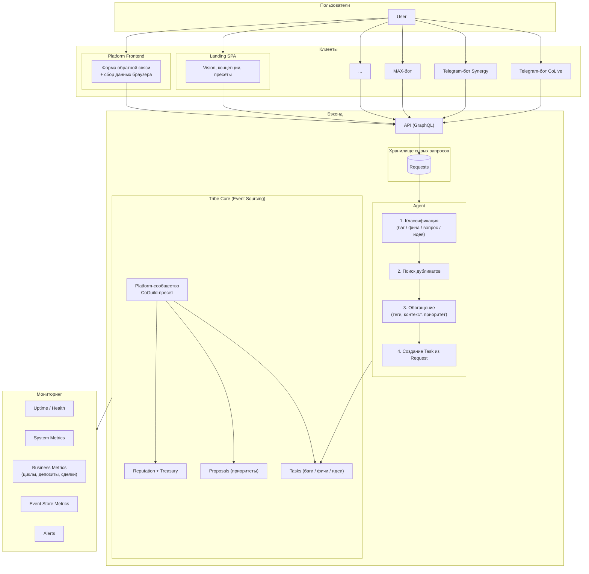

# Платформенная экосистема

> Описание инфраструктуры вокруг Tribe Core: сбор запросов, Agent, Platform-сообщество, мониторинг, боты.

---

## Общая схема



>*Примечание:* Landing SPA и Platform Frontend — пока два клиента к одному API. Будущее объединение или разделение бэкендов не определено.

## Request (сырой запрос)

Когда пользователь отправляет форму или бот собирает обращение — создаётся **Request**.

Request — это черновик: неструктурированные данные, которые ещё не прошли фильтрацию Agent'а.

### Состав Request

| Поле | Источник |
|---|---|
| `id` | Авто |
| `source` | `form` / `bot` (канал: Telegram, Discord...) |
| `user_id` | ID пользователя (если авторизован) |
| `text` | Основной текст запроса |
| `attachments` | Файлы, скриншоты, ссылки |
| `browser_context` | JSON с данными браузера |
| `created_at` | Временная метка |
| `status` | `new` → `processing` → `converted` / `rejected` |

### Сбор данных с браузера

Форма запроса на платформе автоматически собирает технический контекст в поле `browser_context`.

#### Всегда (автоматически)

| Поле | Описание |
|---|---|
| User-Agent | Браузер, ОС, устройство |
| Screen | Разрешение экрана |
| URL | Страница, на которой возник вопрос |
| Timestamp | Временная метка + часовой пояс |
| User ID | Идентификатор пользователя (если авторизован) |
| App Version | Build / commit текущего деплоя |

#### Опционально (по запросу — чекбоксы в форме)

| Поле | Описание |
|---|---|
| Console errors | JS-ошибки из браузера |
| Screenshot | Скриншот экрана |
| Steps to reproduce | Текстовое описание действий перед проблемой |
| Failed network requests | Упавшие API-запросы |

## Agent

Agent — внутренний сервис, который обрабатывает входящие **Request** и превращает их в **Task** в Platform-сообществе.

### Pipeline

1. **Классификация** — определяет тип: `bug`, `feature`, `question`, `idea`
2. **Поиск дубликатов** — проверяет, не существует ли уже похожая Task в Platform-сообществе
3. **Обогащение** — проставляет теги (модуль, пресет), определяет примерный приоритет
4. **Создание Task** — создаёт Task в Platform-сообществе из Request, переводит Request в `converted`

Если Request невалиден (спам, пустой) — Agent переводит его в `rejected`.

### Технически

- Работает как часть бэкенда (встроенный модуль или отдельный микросервис)
- На старте — rules-based (ключевые слова, регулярные выражения)
- В перспективе — LLM для более точной классификации и поиска дубликатов

## Platform-сообщество

Внутреннее сообщество платформы, через которое управляется разработка.

### Пресет

Использует **CoGuild** (тематическое сообщество с курсами и проектами):

| Модуль | Назначение |
|---|---|
| **Tasks** | Баги, фичи, идеи от пользователей (создаются Agent'ом из Request) |
| **Proposals** | Голосования по приоритетам и планам |
| **Content** | Roadmap, changelog, обсуждения |
| **Reputation** | Рейтинг вклада контрибьюторов |
| **Treasury** | Бюджет на разработку, хостинг, инструменты |
| **Billing** | Оплата контрибьюторам, спонсорские поступления |
| **Documents** | Соглашения, лицензии |

### Доступ

- **Только команда разработки** — пользователи не видят Platform
- Каждый член команды — участник сообщества
- Запросы от пользователей попадают как Tasks, созданные Agent'ом из Request

### Жизненный цикл запроса

```
Форма / Бот → Request (сырой) → Agent → Task (Platform)
→ Обсуждение → Proposals (приоритет) → Спринт → Релиз
```

## AI Agent-исполнитель

AI-агент — отдельный сервис (opencode-like), который слушает события из Platform-сообщества и выполняет назначенные ему Task.

### Как работает

```
Platform (Task создан / назначен / изменён)
    │
    ▼ Event (webhook / Event Bus)
AI Agent Service
    ├── 1. Получает событие
    ├── 2. Читает Task: описание, контекст, browser_context, комменты
    ├── 3. Анализирует код через MCP (читает, ищет, diff)
    ├── 4. Генерирует решение (LLM под капотом)
    ├── 5. Создаёт PR / коммит / suggestion
    └── 6. Обновляет Task → status: review
                │
                ▼
         Человек проверяет → approve / reject
                │
                ▼
         Task closed, репутация обновлена
```

### Статус в сообществе

- Участник Platform с ролью `bot`
- На него назначаются Task как на любого другого участника
- Имеет репутацию: растёт от успешно выполненных задач, падает от ошибок
- Видит код репозитория через MCP

### Процесс выполнения

1. Task создаётся или назначается на `@ai-agent`
2. Агент получает событие (webhook или через Event Bus)
3. Читает Task: описание, прикреплённый контекст (browser_context, логи), комментарии
4. Получает доступ к codebase (через MCP — как opencode)
5. Анализирует, генерирует решение
6. Создаёт PR / применяет изменения в отдельной ветке
7. Обновляет Task: статус → `review`, добавляет ссылку на PR
8. Человек проверяет → approve / reject
9. Task закрывается, репутация обновляется

### GitHub Action

Не является инициатором агента. Если используется — только как пост-шаг после создания PR: запуск линтера, тестов, форматирования.

### Автоаппрув (предположительно)

> Детали уточняются на этапе реализации.

Для некоторых типов задач агент может закрывать Task без участия человека:

| Тип задачи | Автоаппрув | Ручной ревью |
|---|---|---|
| Опечатки, стиль кода | ✅ | — |
| Документация, README | ✅ | — |
| Рефакторинг без изменения логики | ✅ | — |
| Core-логика, billing, безопасность | — | ✅ |
| Новые фичи, изменения API | — | ✅ |
| Изменения в БД/миграциях | — | ✅ |

Правила автоаппрува задаются через **Proposals** Platform-сообщества и могут меняться голосованием команды.

## Мониторинг

> Предположение: комбинация готовых инструментов и самописных метрик. Окончательное решение — на этапе реализации.

Система мониторинга покрывает все уровни платформы.

### Уровни

| Уровень | Что отслеживается |
|---|---|
| **Uptime / Health** | Доступность API, Event Store, очередей |
| **System Metrics** | CPU, RAM, IO, количество соединений с БД |
| **Business Metrics** | Количество сообществ, участников, сделок, циклов, депозитов |
| **Event Store** | Скорость записи/чтения событий, размер, latency |
| **Agent Pipeline** | Количество Request: поступило, обработано, отклонено; время обработки |
| **Alerts** | Падение узлов, превышение лимитов, аномалии в бизнес-метриках |

### Инструментарий (предварительно)

| Категория | Инструмент |
|---|---|
| **Готовое** | Prometheus + Grafana (метрики), Loki / ELK (логи), Alertmanager (алерты) |
| **Самописное** | Экспорт бизнес-метрик из кода модулей, health checks (`/health`, `/ready`), метрики Agent pipeline, инцидент-логи как Task в Platform-сообществе |

## Боты

Боты работают на уровне отдельных сообществ и помогают пользователям взаимодействовать с платформой.

### Принципы

- **Per-community** — у каждого пресета свой бот (CoLive-bot, Synergy-bot, CoSpace-bot)
- **MCP-интеграция** — бот использует MCP сообщества для доступа к данным и действиям
- **Сбор сообществ** — бот помогает пользователю найти подходящее сообщество или сформировать новое
- **Выявление запросов** — через диалог бот собирает проблему / идею и создаёт Request

### Платформы

1. **Telegram** — боты под каждый пресет (CoLive-бот, Synergy-бот, ...)
2. **MAX** — отдельный бот для платформы MAX (мессенджер)
3. **Discord** — опционально
4. Остальные — по мере需求

### Функции бота

| Функция | Описание |
|---|---|
| Поиск сообществ | «Найди коливинг в моём городе» |
| Создание запроса | «У меня проблема с оплатой» → Request → Agent → Task |
| Уведомления | Новые задачи, голосования, события в сообществе |
| Онбординг | Помощь новому участнику при регистрации |

## Саморазвитие системы

### Agent self-healing

AI Agent-исполнитель может сам создавать Task в Platform-сообществе на основе данных мониторинга:

- **Падение метрик** — 0 сделок за день, 0 активных участников → Task: «Проверить модуль X»
- **Рост ошибок** — увеличение 5xx, консольных ошибок на фронтенде → Task: «Исследовать рост ошибок»
- **Agent-фильтр** — если Request не классифицируется (unknown type) → Task: «Добавить новый тип запроса»
- **Ухудшение производительности** — рост latency API, отставание проекций → Task: «Оптимизировать проекцию Y»

Task создаётся, проходит обычный цикл (review, approve) и выполняется агентом или человеком.

### Эволюция пресетов (предположительно)

> Детали уточняются на этапе реализации.

Если сообщество настроило уникальную конфигурацию модулей, ролей и правил, и эта конфигурация показывает высокую активность — она может стать шаблоном для нового пресета:

1. Аналитика выявляет повторяющуюся конфигурацию
2. Platform получает предложение: «Создать пресет на основе сообщества X»
3. Голосование команды (Proposals)
4. Если принято — конфигурация становится пресетом, доступным другим сообществам

### Cross-preset расширение (предположительно)

> Детали уточняются на этапе реализации.

Модуль или фича, разработанная для одного пресета, может подключаться к другим:

- **Synergy** (циклы) → доступен как дополнительный модуль для **CoOper**
- **CoLive Tasks** (дежурства) → доступен для **CoSpace**
- **CoSettle Registry** (реестр долей) → доступен для **CoOper**

Решение о расширении принимается голосованием Platform-сообщества.
