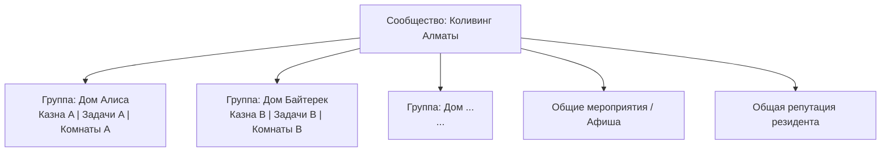

# Дома как группы

## Концепция

Одно сообщество «Коливинг Алматы» содержит несколько домов. Каждый дом — это **группа** внутри сообщества.

Группа имеет:
- Свой бюджет (казна)
- Свой набор задач (дежурства)
- Свой пул комнат (бронирование)
- Свой состав участников
- Свои настройки и правила (оговоренные управляющим или голосованием)

## Зачем группы

| Сценарий | Без групп | С группами |
|---|---|---|
| Переезд между домами | Выход + новый заезд | Смена группы в профиле |
| Общий бюджет на мероприятия | Сложный сплит между домами | Единая касса сообщества |
| Дежурства | По всему сообществу | По дому |
| Репутация | По всему сообществу | Общая + внутридомовая |

## Структура

## Доступ между группами

| Что | Глобально (сообщество) | Локально (группа/дом) |
|---|---|---|
| Профиль жильца | Общий | — |
| Репутация | Общий рейтинг | Отзывы по дому |
| Афиша мероприятий | Все дома | Свой дом + открытые |
| Платежи | — | Взносы в свой дом |
| Задачи | — | Дежурства по дому |
| Голосования | Все дома (правила дома) | Бюджет дома |
| Переезд | Заявка → одобрение | Смена группы админом |
