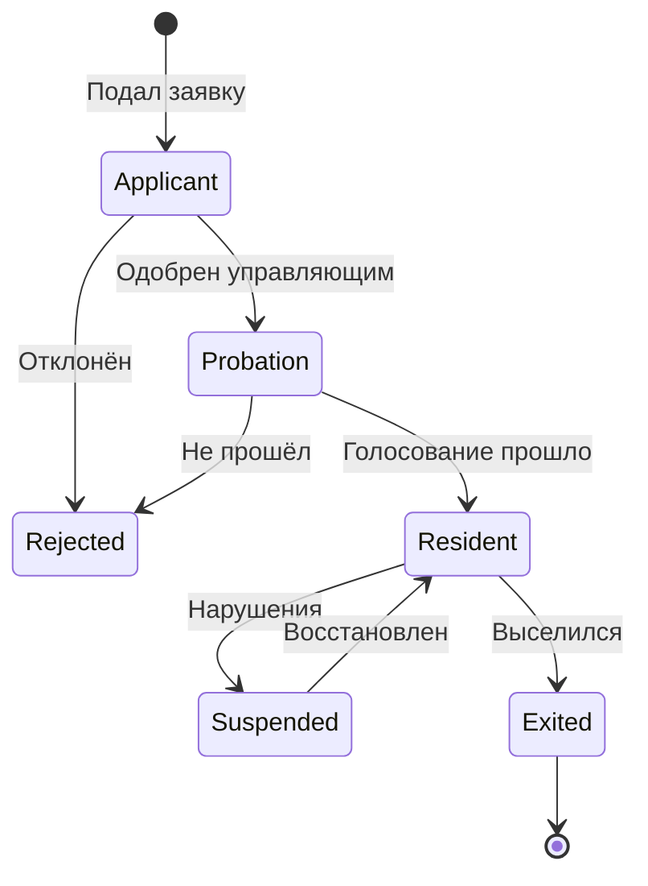

# Модель участников коливинга

## Типы участников

| Тип | Описание | Голосование | Платежи |
|---|---|---|---|
| **Резидент** | Постоянный жилец, член сообщества | Да | Членские взносы + коммуналка |
| **Коммерческий арендатор** | Арендует место без участия в жизни сообщества | Нет | Аренда по договору |
| **Гость** | Краткосрочное проживание (дни–недели) | Нет | Потарифно |
| **Управляющий** | Владелец или наёмный менеджер | Право вето | — |
| **Кандидат** | Подал заявку, проходит отбор | Нет | — |
| **Участник мероприятий** | Не живёт, но посещает ивенты | Нет | Билеты/донаты |

## Процесс приёма

### Варианты входа

| Режим | Описание |
|---|---|
| **Open** | Зарегистрировался, выбрал комнату, оплатил — заехал |
| **Approval** | Заявка → одобрение управляющего |
| **Probation** | Заявка → испытательный срок (1–2 недели) → голосование резидентов |
| **Vouching** | Нужен поручитель из числа резидентов |
| **Invite** | Только по приглашению |

### Рекомендуемый флоу для первого коливинга

```
Заявка → Интервью (управляющий) → Испытательный срок (1–2 недели) 
→ Голосование резидентов → Полноценный резидент
```

## Статусы участника



## Жизненный цикл

1. Заявка (анкета, желаемая комната, срок)
2. Одобрение управляющего
3. Испытательный срок (знакомство с домом, дежурства)
4. Вступление (подписание договора, первый взнос)
5. Проживание (участие в жизни, платежи, репутация)
6. Выход (уведомление, акт, возврат депозита)
