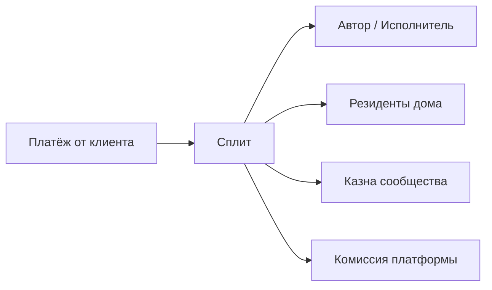

# Модуль Revenue

Распределение доходов от платных сервисов между участниками.

## Концепция

Когда участник сообщества зарабатывает через платформу (продал курс, сдал комнату, оказал услугу), доход автоматически распределяется по настроенным правилам.

## Схема распределения



## Сущности

- **RevenueRule** — правило распределения (сервис → % автору / % резидентам / % казне / % платформе)
- **Payout** — выплата участнику
- **Earning** — заработанная сумма (история)
- **Wallet** — внутренний кошелёк участника (баланс для вывода)

## Actions

| Action | Описание |
|---|---|
| `create_rule` | Создать правило сплита |
| `update_rule` | Изменить правило (требует голосования) |
| `get_earning` | Заработок участника |
| `request_payout` | Запросить вывод средств |
| `get_wallet` | Баланс кошелька |
| `get_community_revenue` | Доход сообщества за период |

## Настройки правил

Правила настраиваются для каждого типа сервиса:

```json
{
  "course": {
    "author": 0.60,
    "residents": 0.10,
    "community": 0.10,
    "platform": 0.20
  },
  "room_rent": {
    "host": 0.50,
    "residents": 0.15,
    "community": 0.15,
    "platform": 0.20
  },
  "service": {
    "provider": 0.60,
    "residents": 0.15,
    "community": 0.10,
    "platform": 0.15
  }
}
```

Правила можно менять голосованием сообщества через модуль Proposals.

## Распределение доли резидентов

Доля, предназначенная резидентам дома, распределяется по **взвешенной доле участия** (Participation Weight). Каждый участник получает долю пропорционально своему вкладу в жизнь сообщества.

### Веса участия

| Метрика | Вес | Откуда берётся |
|---|---|---|
| **Стаж проживания** (дней) | ×1.0 | Membership |
| **Выполненные дежурства** (кол-во) | ×2.0 | Tasks |
| **Посещённые мероприятия** (кол-во) | ×1.5 | Content |
| **Участие в голосованиях** (%) | ×2.0 | Proposals |
| **Своевременные платежи** (%) | ×2.5 | Billing |
| **Репутация** (баллы) | ×1.0 | Reputation |

### Формула

```
Вес участника = Σ(метрика × коэффициент)
Доля участника = Вес участника / Σ(веса всех резидентов) × Пул резидентов
```

### Пример

Дом, 3 резидента, пул резидентов = 5 000 ₸:

| Участник | Стаж | Дежурства | Голосования | Репутация | Вес | Доля |
|---|---|---|---|---|---|---|
| Алишер | 120 д ×1 | 15 ×2 | 80% ×2 | 450 ×1 | 120+30+160+450 = 760 | **46%** = 2 300 ₸ |
| Сара | 60 д ×1 | 5 ×2 | 50% ×2 | 200 ×1 | 60+10+100+200 = 370 | **22%** = 1 100 ₸ |
| Джон | 30 д ×1 | 2 ×2 | 30% ×2 | 100 ×1 | 30+4+60+100 = 194 | **12%** = 600 ₸ |

Новички получают меньше, активные старожилы — больше. Стимул участвовать.

Сообщество может голосованием менять коэффициенты или добавлять новые метрики.

## Примеры для кейсов

| Продукт | Типичный сплит |
|---|---|
| **CoLive** | Курс (автор 70% / казна 10% / резиденты 10%) + аренда комнаты (казна 70% / резиденты 30%) |
| **CoSpace** | Класс (инструктор 70% / казна 30%) + аренда зала внешним (казна 100%) |
| **CoSettle** | Доход от гостевого дома (казна 100%, распределяется между пайщиками) |
| **CoGuild** | Курс (эксперт 75% / казна 15% / менторам 10%) + грант на проект (команда 90% / казна 10%) |
| **CoOper** | Экономия на закупках (пайщикам 70% / фонды 30%) + внешние продажи (50% / 50%) |

## Влияние репутации на комиссию

Участники с высоким рейтингом получают сниженную комиссию платформы:

| Уровень репутации | Комиссия платформы |
|---|---|
| Новичок (0–99) | 20% |
| Жилец (100–299) | 18% |
| Старожил (300–599) | 15% |
| Лидер (600–999) | 12% |
| Легенда (1000+) | 10% |

Разница остаётся участнику — стимул быть активным.

## Пример

Курс «Как открыть свой коливинг» продан за 50 000 ₸. У дома 10 резидентов.

| Кому | % | Сумма |
|---|---|---|
| Автор курса | 60% | 30 000 ₸ |
| Резиденты дома (10 чел) | 10% | 5 000 ₸ (по 500 ₸ каждому) |
| Казна сообщества | 10% | 5 000 ₸ |
| Платформа | 20% | 10 000 ₸ |

Автор с уровнем «Лидер» получает дополнительно 3% (разница комиссии): 31 500 ₸.
В режиме «По репутации» резиденты с высоким рейтингом получат больше, чем 500 ₸, с низким — меньше.

## Вывод средств

Участник может вывести заработанное:
- На карту (Kaspi / банк)
- На баланс сообщества (оплата взносов)
- Другому участнику

Периодичность вывода настраивается сообществом (ежедневно / еженедельно / по запросу).

## Связи

- С [LMS](lms.md) — доход от курсов
- С [Marketplace](marketplace.md) — доход от аренды и услуг
- С [Treasury](treasury.md) — пополнение казны сообщества
- С [Reputation](reputation.md) — снижение комиссии за рейтинг
- С [Billing](billing.md) — выплаты участникам
- С [Proposals](proposals.md) — голосование за правила сплита
