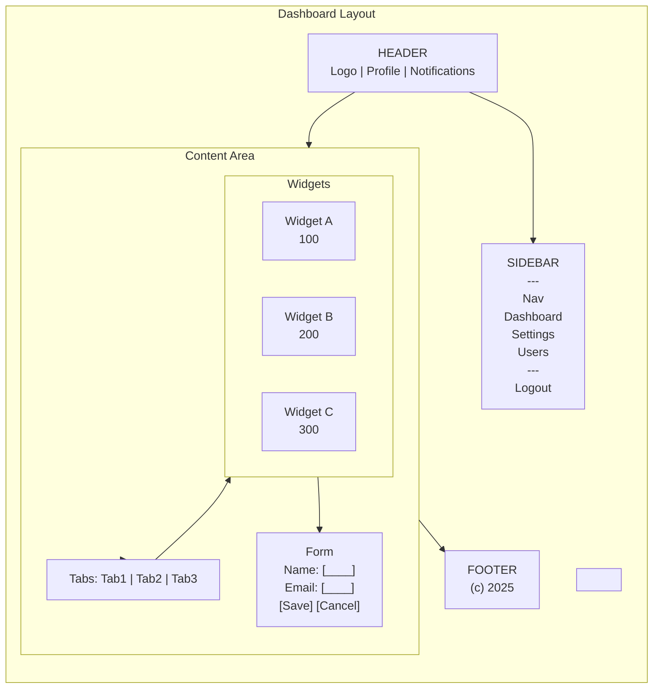

```mermaid
flowchart LR
    subgraph Dashboard["Dashboard Layout"]
        Header["HEADER<br/>Logo | Profile | Notifications"]
        subgrid[" "]
        Sidebar["SIDEBAR<br/>---<br/>Nav<br/>Dashboard<br/>Settings<br/>Users<br/>---<br/>Logout"]
        subgraph Content["Content Area"]
            Tabs["Tabs: Tab1 | Tab2 | Tab3"]
            subgraph Widgets["Widgets"]
                direction LR
                W1["Widget A<br/>100"]
                W2["Widget B<br/>200"]
                W3["Widget C<br/>300"]
            end
            Form["Form<br/>Name: [____]<br/>Email: [____]<br/>[Save] [Cancel]"]
        end
        Footer["FOOTER<br/>(c) 2025"]
    end

    Header --> Content
    Header --> Sidebar
    Content --> Tabs
    Tabs --> Widgets
    Widgets --> Form
    Content --> Footer
```

```plantuml
@startsalt
{
  "Dashboard prototype"
  {T
    + Tab 1 | Tab 2 | Tab 3
    +
    {/ Header (sidebar + topbar)
      {^ "Logo"  |  [Profile] [Notif] }
    }
    {/ Main layout
      | {/ Sidebar
        "Nav"
        [Dashboard]
        [Settings]
        [Users]
        ---
        [Logout]
      }
      | {/ Content
        "Widgets"
        {T
          + Widget A | Widget B | Widget C
          +
          100        | 200       | 300
        }
        ---
        {/ Form
          Name:  "Enter name"
          Email: "email@test.com"
          [Save]  [Cancel]
        }
      }
      |
    }
    {/ Footer
      (c) 2025
    }
  }
}
@endsalt
```
